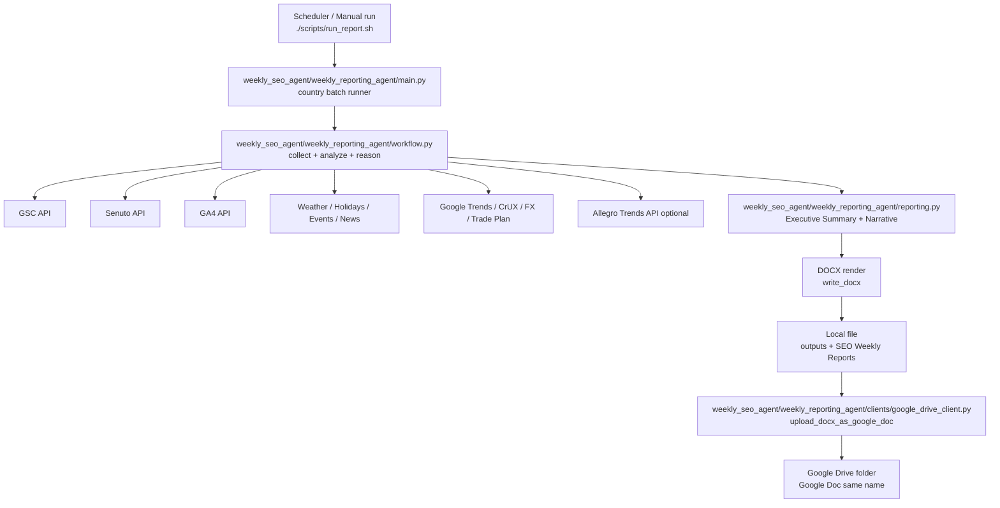

# Weekly Reporting Agent Architecture

## Scope
This document describes the end-to-end flow of the weekly SEO reporting agent and where each responsibility lives in code.

## End-to-end flow

## Component map

- `weekly_seo_agent/weekly_reporting_agent/main.py`
  - Orchestrates multi-country runs (`PL/CZ/SK/HU`) in parallel processes.
  - Builds output filenames (`YYYY_MM_DD_<country>_seo_weekly_report.docx`).
  - Triggers optional upload to Google Docs.

- `weekly_seo_agent/weekly_reporting_agent/workflow.py`
  - Collects source data.
  - Runs core diagnostics (WoW, YoY, clusters, brand/non-brand, feature split).
  - Produces final report content for rendering.

- `weekly_seo_agent/weekly_reporting_agent/reporting.py`
  - Builds final report sections (Executive Summary, What is happening and why, driver table).
  - Applies business-facing formatting and number compaction.
  - Converts markdown-like content into DOCX.

- `weekly_seo_agent/weekly_reporting_agent/clients/*`
  - API integrations (GSC, Senuto, GA4, Drive, Trends, external signals, etc.).

- `weekly_seo_agent/weekly_reporting_agent/config.py`
  - Centralized `.env` parsing and feature flags.

## Google Docs write path (exact)

Implementation reference:
- `weekly_seo_agent/weekly_reporting_agent/clients/google_drive_client.py` (`GoogleDriveClient.upload_docx_as_google_doc`)

1. Workflow returns report text.
2. `write_docx(...)` creates local `.docx`.
3. If Drive upload is enabled, `GoogleDriveClient` is initialized.
4. `upload_docx_as_google_doc(local_docx_path)`:
   - loads OAuth/service-account credentials,
   - finds or creates target folder,
   - removes existing Google Doc with the same name in that folder,
   - uploads DOCX with conversion MIME to Google Docs,
   - returns metadata (`id`, `name`, `webViewLink`).

## Output contract

For each country run:
- One local DOCX file.
- One Google Doc (same base name) when Drive upload is enabled.
- Existing report from other days remains untouched.
- Same-day same-country output is replaced (latest run wins).
